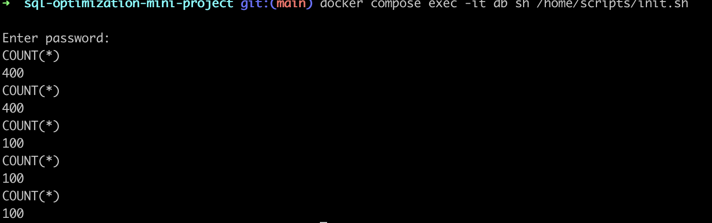

# SQL Optimization Mini Project

- view [notion page](https://www.notion.so/bfmcneill/03-sql-optimizer-409b7a9f791646009e4dc3ecd7d1c299)
- project code is located [https://github.com/bfmcneill/sql-optimization-mini-project](https://github.com/bfmcneill/sql-optimization-mini-project)

## project teardown

```bash
docker compose down -v
```

- stop compose services and remove the volume

## project setup

### 1. configure environment variables

- create `.env` using the template from `.env.example`

```bash
cp .env.example .env
```
 
- open `.env` and set values for database secrets

### 2. spin up and seed db 



```bash
docker compose up -d
```

```bash
docker compose exec -it db sh /home/scripts/init.sh
```

- look up the password for oort user in `.env` file copied from [.env.template](./.env.example)
  
## Questions + Solutions

- all questions in their initial state are located in[sql-questions](./sql-questions/)
- all solutions are located in [sql-solutions](./sql-solutions/)


## references

- [project link](https://www.springboard.com/workshops/data-engineering-career-track/learn#/curriculum/24148)
- [docker compose example](https://nickjanetakis.com/blog/docker-tip-88-switching-mysql-to-mariadb-for-arm-64-m1-support)
- [env files with docker compose](https://docs.docker.com/compose/environment-variables/)
- [MySQL's EXPLAIN Demystified](https://www.youtube.com/watch?v=ZoLoIFW1H6g&ab_channel=Percona)
- [DBeaver Query Execution Plan](https://dbeaver.com/docs/wiki/Query-Execution-Plan/)